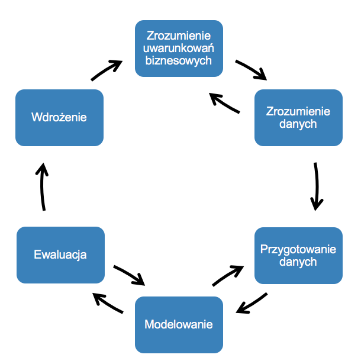

# Dane

Rozwój technologii informatycznych spowodował dostęp do niewyobrażalnych ilości nowego zasobu jakim są **ustrukturyzowane** jak i **nieustrukturyzowane** dane.

> Podaj przykład danych ustrukturyzowanych i nieustrukturyzowanych.

Dane przyczyniły się do powstania tysięcy nowych narzędzi do `generowania`, `zbierania`, `przechowywania` i `przetwarzania` informacji na niespotykaną dotąd skalę.

Dane istnieją od bardzo dawna.
Z początku były one generowane w postaci obrazów w jaskiniach.
Po wprowadzeniu stystemu pisma można było prowadzić rachunkowości czy rejestry wszelakich rzeczy. 
Informacje o najgłębszych jeziorach, najbardziej zaludnionych krajach, spis rzek itp. były publikowane w wielu rodziajach encyklopedii. 
Przed powstaniem maszyn proces pomiarów i ręcznego zapisywania trwał bardzo długo i był bardzo pracochłonny. Dziś maszyny te dostępne są dla każdego człowieka w postaci komputerów czy telefonów. 

Nowe wyzwania naukowe i biznesowe takie jak:

- inteligentna reklama tysięcy produktów dla milionów klientów,
- przetwarzanie danych o genach, RNA czy też białkach [genus](http://genus.fuw.edu.pl),
- inteligentne wykrywanie różnorodnych sposobów nadużyć wśródsetek miliardów transakcji kart kredytowych,
- symulacje giełdowe oparte o tysiące instrumentów finansowych,
- rozpoznawanie miliardów przypadków efektów zderzeń protonówi produkcji cząstek elementarnych w LHC 

stają się możliwe do realizacji dzięki budowie systemów opartych na otwartym oprogramowaniu, jak również dzięki wykorzystaniu domowych komputerów do wspomagania przetwarzania ogromnych ilości danych.

Dziś systemy takie jak SAS, Apache Hadoop, Apache Spark czy Microsoft Azure używane są na szeroką skalę w wielu instytucjach i firmach niemal w każdej dziedzinie gospodarki. 
Epoka „wielkich danych” stawia przed nami coraz to nowsze wyzwania związane nie tylko z ilością, ale i z czasem przetwarzania danych.

W ramach badań nad algorytmami i sztuczną inteligencją (ang. _Artificial Inteligence_ AI) pojawiły się nowe gałęzie badań, które dziś możemy określić jako **machine learning** (ML) oraz **deep learning**(DL).
Dzięki nim powstała możliwość pozyskiwania wiedzy bezpośrenio z informacji zawartych w danych oraz tworzenia na tej podstawie przewidywania zachowywania się badanego układu. 
Dzięki ML i DL nie trzeba już zatrudniać setki ludzi do ręcznego wyznaczania regół czy tworzenia modeli.
Omawiane dziedziny oferują efektywniejsze rozwiązanie polegające na stopniowym poprawianiu skuteczności modeli predykcyjnych oraz podejmowaniu decyzji na podstawie analizowanych danych. 
Mają one zastosowanie w takich dziedzinach jak:

- zaawansowane filtry antyspamowe,
- rozpoznawanie mowy i tekstu,
- silniki wyszukiwarek internetowych
- rekomendacje produktów
- pojazdy autonomiczne
- next best action
- gry
- kampanie marketingowe
- ...

### Główne źródła danych

- Działalność przedsiębiorstw i instytucji (banki, ubezpieczalnie, sieci handlowe, urzędy ...). 
AT&T obsługuje miliardy połączeń dziennie. 
Danych jest tyle, że nie zapisuje się ich a analizy prowadzone są `on the fly`.
- Ośrodki naukowe: $10^9$ rekordów danych astronomicznych, $10^2 \sim 10^3$ atrybutów w systemach diagnozy medycznej. 
Very Long Baseline Interferometry posiada 16 teleskopów, gdzie każdy produkuje 1 Gigabit/sec danych astronomicznych w czasie 25 dniowej sesji obserwacyjnej.
- Baza danych [BrainMaps](http://brainmaps.org) zawiera ponad 50 TB danych z mapami mózgów ssaków.
- Systemy monitorujące pracę urządzeń

## WWW jako źródło danych

Jednym z największych źródeł danych jest obecnie **sieć WEB**
[WorldWideWebSize.com](http://www.worldwidewebsize.com). 
Rok temu **at least 5.55 billion pages** (Thursday, 14 February, 2019). 
Obecnie **at least 5.72 billion pages** (Friday, 14 August, 2020).

# Trochę historii

- Lata 60-te : Kolekcje danych, bazy danych, sieciowe DNBMS
- Lata 70-te : Relacyjne modele danych i ich implementacja w systemach OLTP
- Lata 80-te : Zaawansowane modele danych, extended-relational, objective oriented, aplikacyjno-zorientowane itp.
- Lata 90-te : Data mining, hurtownie danych, multimedialne bazy danych, systemy OLAP
- Później : NoSQL, Hadoop, SPARK, data lake

## Modele przetwarzania danych

Większość danych przechowywana jest w bazach lub hurtowniach danych.
Standardowo dostęp do danych sprowadza się najczęściej do realizacji zapytań poprzez aplikacje. 
Sposób wykorzystania i realizacji procesu dostępu do bazy danych nazywamy **modelem przetwarzania**.

### Model Tradycyjny

**Model tradycyjny** - przetwarzanie transakcyjne w trybie on-line, OLTP (on-line transaction processing). 
Świetnie sprawdza się w przypadku obsługi bieżącej np. obsługa klienta, rejestr zamówień, obsługa sprzedaży itp. 

Model ten dostarcza efektywnych rozwiązań do:

- efektywne i bezpieczne przechowywanie danych,
- transakcyjne odtwarzanie danych po awarii,
- optymalizacja dostępu do danych,
- zarządzanie współbierznością,
- inne.

A co w przypadky gdy mamy doczynienia z:

- agregacjami danych,
- wspomaganie analizy danych, 
- raportowanie i podsumowania danych,
- optymalizacja złożonych zapytań,
- wpomaganie decyzji biznesowych. 

Badania nad tego typu zagadnieniami doprowadziły do sformułowania nowego modelu przetwarzania danych oraz nowego typu baz danych - **Hurtownie Danych** _(Data warehouse)_.

### OLAP

**Przetwarzanie analityczne on-line OLAP (on-line analytic processing).**

 Wspieranie procesów analizy i dostarczanie narzędzi umożliwiających analizę wielowymiarową (czas, miejsce, produkt).

 Analiza danych z hurtowni to przede wszystkim obliczanie **agregatów** (podsumowań) dotyczących wymiarów hurtowni. 
 Proces ten jest całkowicie sterowany przez użytkownika.

**Przykład**

Załóżmy, że mamy dostęp do hurtowni danych gdzie przechowywane są informacje dotyczące sprzedaży produktów w supermarkecie. 
Jak przeanalizować zapytania:

1. Jaka jest łączna sprzedaż produktów w kolejnych kwartałach, miesiącach, tygodniach ?
2. Jaka jest sprzedaż produktów z podziałem na rodzaje produktów ?
3. Jaka jest sprzedaż produktów z podziałem na oddziały supermarketu ?

Odpowiedzi na te pytania pozwalają określić `wąskie gardła` sprzedaży produktów przynoszących deficyt, zaplanować zapasy w magazynach czy porównać sprzedaż różnych grup w różnych oddziałach supermarketu.

## OLAP $\to$ Data Mining

OLAP to : analiza danych hurtowni sterowana całkowicie przez użytkownika. 
Użytkownik formułuje zapytania i dokonuje analizy. 
Rozszerzenie standardu języka dostępu do baz danych SQL o możliwość efektywnego przetwarzania złożonych zapytań zawierających agregaty.

### Wady OLAP

- Oferowanie zbyt szczegółowego poziomu abstrakcji
- Brak możliwości formułowania bardziej ogólnych zapytań, np. Jakie czynniki kształtują popyt? 
czym różnią się klienci w sklepie A od klientów w sklepie B?
jakie produkty kupowane są wraz z piwem ? 
czy można przewidzieć popyt na określone produkty ? 
jakie są ogólne korelacje sprzedaży ze względu na lokalizacje i asortyment ? ...
- Brak automatyzacji procesu analizy oraz ograniczony zakres analizy.

### Dalsze rozwiązania ?

# Eksploracja Danych (Data Mining)

## Definicja 1

> Eksploracja danych jest procesem odkrywania znaczących nowych powiązań, wzorców i trendów przez przeszukiwanie zgromadzonych danych przy wykorzystaniu metod rozpoznawania wzorców, jak również metod statystycznych i matematycznych.

## Definicja 2

> Eksploracja danych jest między dyscyplinarną dziedziną, łącząca techniki uczenia maszynowego, rozpoznawania wzorców, statystyki, bez danych i wizualizacji w celu uzyskiwania informacji z dużych baz danych.

Wszystkie definicje wskazują, iż celem eksploracji danych jest odkrywanie zależności, które nie były wcześniej znane odbiorcy.

**W wyniku realizacji procesu eksploracji danych otrzymujemy:**

## MODEL

Modelami mogą być:

- równania liniowe,
- reguły,
- skupienia,
- grafy,
- struktyry drzewiaste,
- wzory rekurencyjne w szeregach czasowych.

Rola badacz DM - jak znaleźć informacje, których wzorce są nieznane i mogą być użyteczne ?

# Uczenie maszynowe (Machine Learning)

Za pomocą ML identyfikujemy procesy, dzięki którym zdobywamy wiedzę nie zawsze możliwą do bezpośredniego wnioskowania z danych, a jednocześnie przydatną do podejmowania decyzji. 
Jest narzędziem stosowanym do wieloskalowego przetwarzania danych i świetnie nadaje się do obsługi złożonych zbiorów danych. 
Zdolność predykcji modeli ML wykorzystuje się bardzo często do systemów sztucznej inteligencji (**AI**).

## Definicja 1

> (ML) to dziedzina nauki dająca komputerom możliwość uczenia się bez konieczności ich jawnego programowania. - A. Samuel, 1959

## Definicja 2 

> Mówimy, że program komputerowy uczy się na podstawie doświadczenia E w odniesieniu do jakiegoś zadania T i pewnej miary wydajności P, jeśli jego wydajność wobec zadania T wzrasta wraz z nabywaniem doświadczenia E. - T. Mitchell, 1997

Najczęściej rodzaje systemów uczenia maszynowego dzielimy ze względu na nadzór człowieka w procesie trenowania: 

1. Uczenie nadzorowane (_supervised learning_). Dane uczące przekazywane do algorytmów zawierają dołączone etykiety (_labels_)

- Klasyfikacja
- Regresja dla przewidywania wyników ciągłych

2. Uczenie nienadzorowane (_unsupervised learning_). Dane uczące są nieoznakowane.

- Wyznaczanie podzbiorów za pomocą grupowania
- Redukowanie wymiarowości w celu kompresji danych

3. Uczenie przez wzmocnienie (_reinforcement learning_). System uczący (agent) obseruje środowisko i dobiera wykonywane czynności tak by odbierać nagrody (lub kary). Uczy się w ten sposób najlepszej strategii (polityki) tak by zmaksymalizować nagrodę. 

 
### Algorytmy

- regresja liniowa
- regresja logistyczna
- drzewa decyzyjne i lasy losowe
- sieci neuronowe
- XGB
- k-najbliższych sąsiadów 
- naiwny Bayes
- maszyny wektorów nośnych
- k-means
- hierarchiczna analiza skupień
- analiza głównych składowych
- reguły asocjacyjne
- detekcja anomalii 

# Uczenie głębokie (Deep Learning)

## Zastosowania praktyczne 

1. _AlphaGo_ to maszyna ze sztuczną intelignecją bazującą na uczeniu głębokim, która w 2016 roku pokonała mistrza w grze Go (Lee Sedol).

2. 2009 - Netflix system rekomendacji (nagroda 1 000 000 dolarów)

3. 2013 rok - wykorzystanie metod uczenia maszynowego do wykrywania i identyfikacji ptaków na podstawie danych dźwiękowych.

4. 2015 - Na podstawie dancyh o pogodzie, terenie, badaniach i opryskach przewidzieć kiedy i gdzie określone gatunki komarów przejdą pozytywny wynik  testu na roznoszenie wirusa Zachodniego Nilu.

5. 2015 - Prognoza cen wynajmu mieszkań w Australii Zachodniej

6. 2016 - Przyśpieszenie procesu zarządzania reklamacjami

7. inne - pojazdy bezzałogowe, system rozpoznawania celów, systemy czytające notatki lekarskie, systemy wykrywania twarzy

Innym (bardziej nas insteresującym) kryterium stosowanym do klasyfikowania ML jest możliwość trenowania przyrostowego przy użyciu strumienia nadsyłanych danych. 

1. W mechanizmie uczenia wsadowego (_batch learning_) do nauki muszą wystarczyć wszystkie dostępne dane. Zazwyczaj stosowane (szczególnie do nauki) wymaga jednak dużej ilości czasu i zasobów. Prowadzony w trybie offline. System najpierw jest uczony, a następnie wdrożony zostaje do cyklu produkcyjnego. Pojawiające się nowe dane wymagają uczenia systemu od początku i zastąpnia starego nowym. Proces ten łatwo zautomatyzować jednak wymaga on sporego nakładu. 

2. W mechanizmie uczenia przyrostowego (_online learning_) system jest trenowany na bieżąco poprzez sekwencyjne dostarczanie danych. Bardzo często zamiast pojedynczych przypadków (wierszy) generowane są minipakiety (_mini-batches_). Uczenie takie sprawdza się dobrze w systemach odbierających ciągły strumień nowych danych (np. ceny akcji). Co ciekawe dane użyte do nauki nie muszą być przetrzymywane i moża się ich pozbyć. Najczęściej systemy takie używane są do śledzenia działania urządzeń oraz reagowania na ich nienormalne działanie. 

# Data Science Lifecycle

