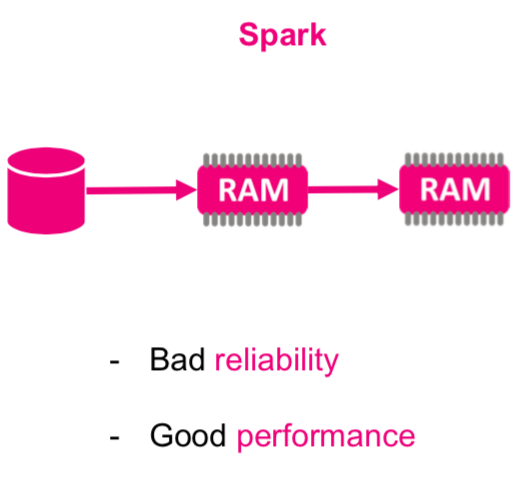
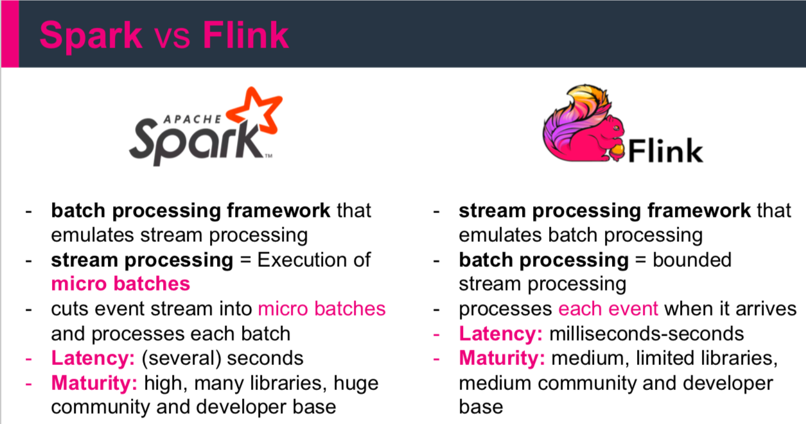

## Batch vs Stream Processing

Oczekiwania vs Rzeczywistość

Kiedy podjąć decyzję biznesową ?

### Rodzaj danych

1. Batch = Duże, historyczne zbiory
2. Stream = Strumień danych, on line, przesyłane w trybie ciągłym

### Czas uruchomienia przetwarzania

1. Batch = minuty, godziny, dni (patrz Hurtownie danych)
2. Stream = Real-time/near-real-time

### Ponowne przetwarzanie

1. Batch = możliwe i stosowane bardzo czesto
2. Stream = ,,niemożliwe''

### ETL

Extract, Transform, Load is a basic pattern for data processing,
commonly known in data warehousing. It's all about *extracting* data from
a source, *transforming* the data (business rules) and at the end *writing/loading*
everything to a target (Hadoop, Relational Database, Data Warehouse etc.)

## Big Data

Systemy Big data mogą być częścią (źródłem) dla hurtowni danych (np. Data Lake, Enterprise Data Hub)

Ale Hurtownie danych nie są systemami Big Data!

1. Hurtownie danych
- przetrzymywanie danych wysoko strukturyzowanych
- skupione na analizach i procesie raportowania
- $100%$ accuracy

2. Big Data
- dane o dowolnej strukturze
- służy do różnorodnych celów opartych na danych (analityka, data science ...)
- poniżej $100%$ accuracy

## Hadoop Map Reduce

> Znajdź prosty algorytm map reduce w dowolnym języku programowania i uruchom go.

Jak poprawić ?

### APACHE SPARK

 

## Strumienie Danych

> Zapoznaj się z tematem [danych strumieniowych](https://medium.com/cuelogic-technologies/analyzing-data-streaming-using-spark-vs-kafka-bcfdc33ac828)

> Definicja - *Zdarzenie* czyli wszystko co możemy zaobserwować w pewnej chwili czasu.
> Definija - W przypadku danych *zdarzenie* rozumiemy jako niezmienialny rekord w strumieniu danych zakodowany jako JSON, XML, CSV lub binarnie.

Które z wymienionych zdań nie przedstawiają zdarzeń?
1. to był ciepły dzień.
2. Klient API nie działał.
3. Klient API przestał działać o północy.
4. Samochód był czarny.
5. Murzynek był smaczny.
6. W 2013 roku giełda NASDAQ otwierana była każdego dnia o 9:30.

> Definicja - Ciągły strumień zdarzeń to nieskończony zbiór pojedynczych zdarzeń uporządkowanych w czasie np logi z urządzenia.

Systemy generujące ciągłe strumienie zdarzeń:
- Systemy transakcyjne - np zakup/sprzedaż
- Hurtownie danych - przechowuje historię zdarzeń w celu późniejszej analizy (Tabela Faktów).
- Dane z sensorów: Systemy monitorujące, IoT, dowolne API (Twitter), systemy kolejkujące (Kafka),
- Śledzenie lokalizacji
- Interackcja z użytkownikiem: co robią użytkownicy Twojej witryny ?

- Webserver logs
- Systemy rekomendacyjne (personalizacja)

### Strumienie danych

> Definicja - Strumień danych to dane tworzone przyrostowo w czasie, generowane ze statycznych danych (baza danych, czytanie lini z pliku) bądź w sposób dynamiczny (logi, sensory, funkcje).

Niezależnie od zastosowanej technologi wszystkie dane powstają jako ciągły strumień zdarzeń (działania użytkowników na stronie www, logi systemowe, pomiary z sensorów).

> Znajdź proces w którym tworzona jest cała tabela danych na raz ?

`Stateful stream processing` is an application design pattern for processing
unbounded strems of events and is applicable to many different use cases in the
IT infrastructure of a company.

Aplikacja przetwarzająca strumień zdarzeń powinna umożliwiać przetworzenie i zapisanie zdarzenia oraz dostęp (w tym samym czasie) do innych danych tak by móc dane zdarzenie przetworzyć (wykonać na nim dowolne przeliczenie) i zapisać jako `stan lokalny`. Stan ten może być zapisywany w wielu miejscach np. zmienne w programie, pliki lokalne, wew i zew bazy danych. Jedną z najbardziej znanych aplikacji tego typu jest Apache Kafka, którą można łączyć np. z Apache Spark bądź Apache Flink.  

> Znajdź info jak działają systemy przetwarzające logi.

Tego typu aplikacje wykorzystuje się w trzech klasach aplikacji:

1. event-driven applications
2. data pipeline applications
3. data analytics applications

> Prawdziwe realizacje najczęściej korzystają z kilku klas w jednej aplikacji.

### Event-driven apps

Wszystkie Event-driven aplikacje przetwarzają dane jako Stateful stream processing przetwarzając zdarzenia z pewną ustaloną (najczęćiej biznesową) logiką. Aplikacje te mogą wywoływać akcje w odpowiedzi na przeanalizowane zdarzenia np. wysłać alarm w postaci sms lub email, zapisać i przekazać odpowiedni event (np. fraud) do aplikacji wyjściowej (consumer).

Standardowym zastosowaniem tego typu aplikacji są:

1. Rekomendacje w czasie rzeczywistym - np w trakcie przeglądania stron www
2. Wykrywanie wzorców lub złożona analiza np. detekcja fraudów w transakcjach kartą kredytową.
3. Detekcja anomalii - wykrywanie włamań w sieci komputerowej

Aplikacje tego typu traktuje się jako naturalną evolucję mikroserwisów. Komunikują się one między sobą wykorzystując zapytania typu REST (koniecznie sprawdź gdzie ich używasz !!!) z wykorzystaniem sturturalnych danych. Korzystają również z danych w postaci JSON.

> Czym jest REST ?

Komunikacja logami (najczęściej asynchroniczna) wyróżnia aplikacje wysyłającą (producer) oraz aplikację konsumującą (consumer).

> Co to komunikacja asynchroniczna ?

### Data Pipelines

Dane generowane przez firmy najczęściej przechowywane są w wielu różnych formatach i strukturach danych, co związane jest z wykorzystaniem różnych systemów
np. relacyjne i nierelacyjne bazy danych, logowanie zdarzeń, systemy plików (np Hadoop), przechowywanie w pamięci etc. Zapis tych samych danych w różnych systemach zwiększa ich dostępność i łatwość przetwarzania.

Jednak takie podejście wymaga aby systemy te były ze sobą zawsze zsynchronizowane (zawierały te same dane).

Tradycyjne podejście synchronizacji danych to wykonywanie okresowo zadań ETL. Jendak bardzo często nie spełniają one założeń wydajnościowych i jakościowych (czas przetwarzania). Alternatywnie moża użyć informacji rozsyłanych w event logach.
W tej sytuacji agregacje czy normalizacja danych mogą być przeprowadzane dopiero podczas przetwarzania danego zdarzenia.

Tego typu aplikacje, które pozwalają osiągnąć bardzo dużą wydajność (niską latencje) nazywamy `data pipelines`.
W ogólności to aplikacje czytające dużo danych z różnych aplikacji wejściowych i przetwarzających wszystko w bardzo krótkim czasie (np Kafka, Apache Flink).

### Data analytics applications (streaming analytics)

Zadania ETL okresowo (i periodycznie w czasie) importują dane do bazy danych, przy czym dane te są przetwarzane przez zaplanowane zapytania.
Niezależnie od architektury hurtowni danych (lub składników np. Hadoop) przetwarzanie to jest przetwarzaniem `batchowym`.
Procesy analityczne (OLAP) wykonywane są na hurtowni, która uzupełniana jest w powyżej opisany sposób. Mimo, iż periodyczne uzupełnianie danych (czyli cały proces ETL) to swego rodzaju `sztuka` to wprowadza ona w proces analityczne spore opóźnienia.
W zależności od harmonogramu dogrywania danych kolejny punkt danych może pojawić się po godzinie lub nawet kilku dniach.
Nawet w przypadku ciągłego uzupełniania hurtowni (data pipeline app) wciąż pojawia się znaczne opóźnienie w analitycznym odpytywaniu takiej bazy.
O ile takie opóźnienia były akceptowalne w przeszłości, dzisiejsze aplikacje muszą zbierać, przetwarzać i analizować dane w czasie rzeczywistym (personalizowanie zachowań użytkownika na stronach www czy dynamiczna zmiana warunków w grach mobilnych).

Zamiast czekać na okresowe wyzwalanie, aplikacja do analizy strumieniowej w sposób ciągły pobiera strumienie zdarzeń i aktualizuje wyniki, włączając najnowsze zdarzenia z małym opóźnieniem.
Aplikacje do przesyłania strumieniowego przechowują wyniki w zewnętrznym magazynie danych, który obsługuje wydajne aktualizacje (wydajna baza danych lub baza oparta o klucz-wartość).
Odświerzane na żywo wyniki działania aplikacji przesyłania strumieniowego mogą zasilać różnego rodzaju wykresy (prezentowane na żywo).

 

Strumieniowe Aplikacje Analityczne używane są w:
1. Monitorowanie jakości sieci telefonicznych
2. Analiza behawioralna uzytkowników aplikacji mobilnych
3. ...
