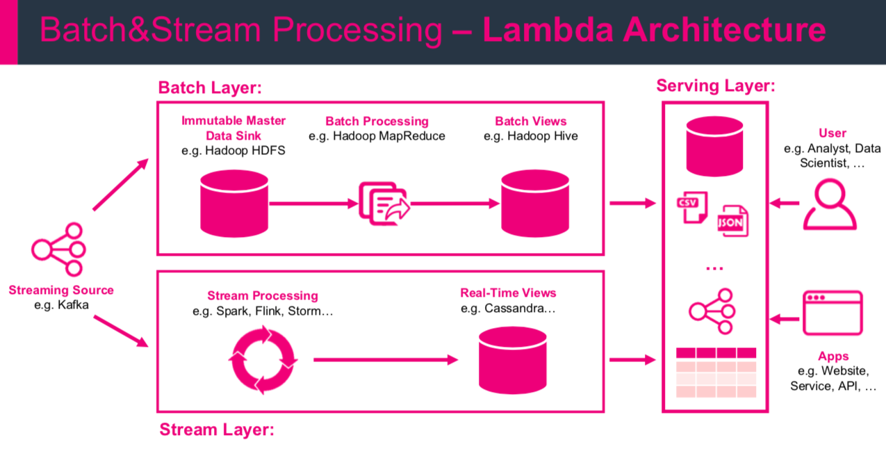

## Podstawowe typy aplikacji do przetwarzania danych strumieniowych

1. event-driven applications
2. data pipeline applications
3. data analytics applications

## Ewolucja oprogramowania do przetwarzania danych strumieniowych

Technologia przetwarzania danych strumieniowych zaczęła rozwijać się w późnych latach 1990. Bardzo duży wpływ na ten sektor miał rozwój oprogramowania Open Source oraz rozwój technologiczny. Dziś darmowe oprogramowanie do przetwarzania strumieni danych wspiera rozwój wielu przedsiębiorstw w różnych gałęziach takich jak: sprzedaż online, social media, telekomunikacja, gry, bankowość. Głównym sukcesem oprogramowania Open Source jest fakt, iż każdy może modyfikować i przetwarzać istniejące oprogramowanie na własny użytek oraz fakt tworzenia się dużych grup tworzących wciąż nowe rozwiązania. Apache Software Foundation - setki(jeśli nie tysiące) projektów oprogramowania do przetwarzania danych w czasie rzeczywistym.

### Architektury - historia

#### Pierwsza generacja
Pierwsza generacja systemów real-time opartych licencję Open Source (2011) skupiała się na przetwarzaniu eventów z milisekundową precyzją oraz na implementacji mechanizmów pozwalających odzyskać informacje przy awarii całego systemu. Systemy te cechowały się raczej niskim poziomem dostępnego API i nie zapewniały wbudowanej obsługi dokładnych i spójnych wyników aplikacji (wyniki zależne były od czasu i kolejności przychodzących zdarzeń). W porównaniu do przetwarzania batchowego nakierowane były one głównie na uzyskanie ,,gorszych'' wyników ale otrzymaych w krótszym czasie. Mogło zdarzyć się, iż ten sam event przetwarzany był kilkakrotnie. Architekturą pierwszej generacji były tzw. architektury `Lambda`.

Architektura ta rozszerzała tradycyjną architekturę hurtowni danych (w przetwarzaniu batchowym) o dodatkowy kanał do szybkiego przetwarzania. Dane przetwarzane były zarówno przez część `speed (stream) layer` jak i zapisywane batchowo do baz danych. Część real time przeprowadzała przybliżone obliczenia w czasie ,,prawie rzeczywistym'' (`near real time`) a wyniki zapisywane były do szykiej bazy NoSQL (np. Cassandra, etc). Następnie wyniki te były łączone z dokładnymi wynikami w kanale batchowym.
Architektrua Lambda nie jest już najnowszym rozwiązaniem ale przydaje się jeszcze w wielu miejscach. Jej głównym celem było wygenerowanie obliczeń (przetwarzania) wspomagającego proces batchowy w celu zmniejszenia latencji.

1. Wymaga dwóch niezależnych ale równoważnych w przetwarzaniu logiki biznesowej kanałów obsługujących najczęściej dwa różne API.
2. Wyniki otrzymywane są w sposób przybliżony
3. Trudna do realizacji

#### Druga generacja

Następna generacja oprogramowania open source do przetwarzania danych w czasie rzeczywistym pojawiła się juz w 2013 roku. Skłupiała się ona na poprawie awaryjności systemów pierwszej generacji, zapewniając przetworzenie każdego eventu dokładnie raz - dokładniejszy wynik. Ulepszone zostało również API. Jednakże poprawa przepustowości oraz obsługi awaryjności sprawiła, iż systemy te wydłużyły swoją operacyjność z milisekund do kilku sekund.
Ponadto wynik wciąż zależały od czasu i porządku przychodzących zdarzeń.

#### Trzecia generacja

Trzecia generacja skupiła się na rozwiązaniu problemu zależności wyników od czasu i kolejności zachodzących zdarzeń. Aplikacje tej generacji (2015 r.) są pierwszymi systemami pozwalającymi otrzymywać spójne i dokładne wyniki.
Dodatkowo pozwalają one wykorzystać zastosowane mechanizmy do przetwarzania danych historycznych tak jakby były one generowane w czasie rzeczywistym. Rozwiązano również problem stosunku opóźnienia i przepustowości otrzymując dobry kompromis między tymi dwoma własnościami. Poprzednie systemy zapewniały tylko albo dużą przepustowość albo małe opóźnienia. Dzięki tym systemom architektura Lambda może być uznana za przestarzałą. Systemy te rozwijane są w takich kierunkach jak:

1. Nowe funkcjonalności operacyjne - łatwa i z dużą ilością własności konfiguracja
2. Rozszerzenie integralności ze różnymi źródłami (managers like YARN, Kubernetes etc)
3. Dynamiczne skalowanie aplikacji strumieniowych
4. Coraz większe wsparcie techniczne
