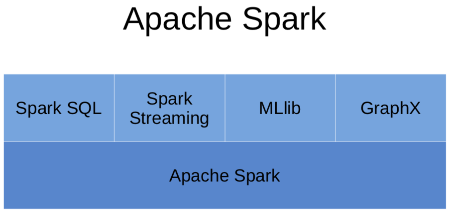
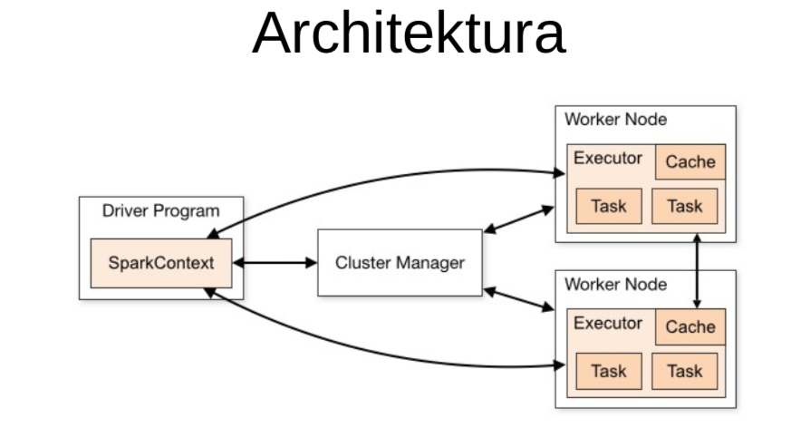

## Podsumowanie poprzednich zajęć

Na poprzednich dwóch zajęciach laboratoryjnych zrealizowaliśmy zagadnienia dotyczące przetwarzania danych ustrukturyzowanych i nieustrukturyzowanych w trybie wsadowym. Ponadto przygotowaliśmy środowisko produkcyjne (z wykorzystaniem biblioteki FLASK) wykorzystujące model napisany w pełni obiektowo otrzymany po wstępnym przetworzeniu danych (irys).   

1. Ustrukturyzowane dane - tablice numpy, ramki danych Pandas, tabele danych w bazach SQL (tworzenie, filtrowanie, modyfikacja)
2. Nieustrukturyzowane dane - JSON, tensory numpy (odczyt, zapis, przetworzenie)
3. Wykorzystanie obiektowego programowania w Pythonie - podstawa budowy klas, tworzenie obiektów, korzystanie z pól obiektów i metod (funkcji).
4. Stworzenie modelu klasyfikacji binarnej opartego o sieć perceprtornu oraz wykorzystującą algorytm Adeline napisany obiektowo w pełnej analogii do modeli z biblioteki sklearn.
5. Wykorzystanie środowiska SQLAlchemy do łączenia się z bazami danych.
6. Strona www realizująca API z wykorzystaniem modelu - nowe dane w czasie rzeczywistym + prognoza - Jako system odpytywania modelu w czasie rzeczywistym (Zastanów się jak go unowocześnić)


Podczas przerabiania dowolnych technik uczenia maszynowego najczęściej (jeśli nie zawsze) jesteśmy uczeni realizacji zadań takiego systemu z podziałem na trzy podstawowe kategorie:

1. Uczenie nadzorowane  - supervised learning
    - klasyfikacja - zrealizowany na poprzednich ćwiczeniach
    - Regresja liniowa
2. Uczenie nienadzorowane - unsupervised learning
3. Uczenie przez wzmacnianie - reinforcement learning

Jednak systemy te można również klasyfikować ze względu na `możliwość trenowania przyrostowego przy użyciu strumienia nadsyłanych danych`

1. **Uczenie wsadowe - batch learning**. To system w którym do jego nauki musisz wykorzystać wszystkie zapisane i już istniejące dane. Zajmuje zazwyczaj dużo czasu i zasobów - przeprowadzany w trybie offline. System wpierw jest uczony, a następnie zostaje wdrożony do cyklu produkcyjnego i już więcej nie jest trenowany (korzysta tylko ze zdobytych wcześniej informacji). Zjawisko to nazywane jest **uczeniem offline**.

Jeśli chcesz aby system uczenia wsadowego brał pod uwagę nowe dane to musisz od podstaw wytrenować nową wersję systemu przy użyciu wszystkich dostępnych danych, wyłączyć stary system i zastąpić go nowym. Na szczęście proces ten jest w pełni automatyzowalny. Jednak trzeba pamiętać, iż trenowanie nowego modelu na pełnym zbiorze danych może trwać bardzo długo (i jest dość kosztowne) stąd wymiana modeli pojawia się np raz na tydzień raz na dzień. W przypadku bardzo dużej ilości informacji system taki może szybko przestać działać - zamiast wykonywać swoje zadania będzie obliczał nowy model.

2. W procesie **uczenia przyrostowego - online learning** system trenowany jest na bieżąco poprzez sekwencyjne dostarczanie danych (pojedyncze lub minipaczki - mini-batches). Każdy krok uczenia jest szybki i mało kosztowny. Uczenie następuje w momencie pojawienia się nowych danych.

Uczenie przyrostowe sprawdza się wszędzie tam gdzie układ odbiera ciągły strumień danych (urządzenia IoT, giełda) i wymagana jest szybkie i autonomiczne dopasowanie do nowych warunków. Przydaje się również przy pracy z ograniczonymi zasobami obliczeniowymi (stare dane nie są istotne).

Dużym problemem uczenia przyrostowego jest stopniowy spadek wydajności systemu w przypadku gdy dostarczone dane przestają być prawidłowe. Np. uszkodzony czujnik, celowe zasypywanie przeglądarki danymi w celu podbicia rankingu w wynikach wyszukiwania (algorytmy wykrywania anomalii).


[Stochastic gradient descent](https://en.wikipedia.org/wiki/Stochastic_gradient_descent)

[Stochastic learning](https://leon.bottou.org/publications/pdf/mlss-2003.pdf)

## Środowisko Apache SPARK

Pierwszym środowiskiem do przetwarzania danych strumieniowych będzie Apache Spark.
Zanim jednak zmierzymy się z strumieniami poznamy narzędzie Spark wykorzystywane do analiz w trybie batch'owym dla dużych danych.


[Darmowa książka z wprowadzeniem do Sparka](https://pages.databricks.com/rs/094-YMS-629/images/LearningSpark2.0.pdf)


1. Silnik analityczny do przetwarzania danych na dużą skalę.
2. Projekt open source, od 2013 w Apache Software Foundation.
3. Napisany w Scali.
4. Udostępnia API w Java, Scala, Python, R.
5. Aplikacje możemy tworzyć  w lokalnym środowisku korzystając z interfejsów wysokiego poziomu,
  - pozwala na interaktywne korzystanie i stosowanie złożonych algorytmów,
  - wykorzystanie różnych metod przetwarzania danych: zapytania SQL, przetwarzanie tekstów, systemy uczące i przetwarzające grafy,
  - przygotowane aplikacje można uruchomić na wielu węzłach uruchomionych w ramach klastra Spark.








### Instalacja i uruchomienie

Oprogramowanie Apache Spark można uruchomić na wszystkich popularnych systemach (Win, Linux, Mac OS) jako aplikacje jednostanowiskowe.

Do realizacji projektów w środowisku jednostanowiskowym można skorzystać z platformy Jupyter w której zintegrowano program Spark w ramach narzędzia pyspark.


Oprogramowanie można zainstalować lokalnie lub korzystając z przygotowanego kontenera Docker.

**Wersja Docker**

Obraz przygotowany na zajęcia z plikami z zajęc.
```{bash}
docker run -d -p 8888:8888 sebkaz/docker-spark-jupyter
```

Oficjalny obraz Sparka z jupyter notebookiem.
```{bash}
docker run -d -p 8888:8888 jupyter/pyspark-notebook
```

Obie wersje wymagają ściągnięcia ok 2GB.

**Wersja lokalna** (komputer ze środowiskiem Python + instalacja JAVA JDK 8 !)

Środowisko Windows:
- instalacja środowiska Java JDK,
- instalacja oprogramowania Apache Spark:
    - [Ściągnij katalog](https://www.apache.org/dyn/closer.lua/spark/spark-3.1.1/spark-3.1.1-bin-hadoop2.7.tgz)
    - wypakuj ściągnięte archiwum np 7z
    - umieść w wygodnym miejscu i zapisz ścieżkę (zmień nazwę katalogu np na spark)
- środowisko do realizacji projektów w języku python:
    - uruchom jupyter notebook'a


```{python}
import findspark
# domyślna pełna konfiguracja 
findspark.init()
# dla konfiguracji bez zmiennych systemowych Sparka - Windows
findspark.init("C:/Users/SebastianZajac/Desktop/spark")
# dla konfiguracji bez zmiennych systemowych Sparka - Linux, Mac
findspark.init("/Users/air/Desktop/spark3/")
```
Jeśli wszystko zadziałało możesz wygenerować obiekt SparkContext.


### SparkContext

1. Główny, podstawowy obiekt
2. Punkt wejścia do pracy ze Sparkiem
3. Generowanie obiektów RDD

```{python}
# inicjalizacja SparkContext
from pyspark import SparkContext
sc = SparkContext(appName="myAppName")
sc
```

### SparkSession

1. Główny punkt wyjścia do SparkSQL
2. Opakowuje (wrapper) SparkContext
3. Zazwyczaj pierwszy obiekt, który będziemy tworzyć

```{python}
from pyspark.sql import SparkSession

spark = SparkSession.builder\
        .appName("new")\
        .getOrCreate()
```
Posiadając obiekt `SparkSession` możesz odtworzyc obiekt SparkContext.
```python
# otrzymanie obiektu SparkContext
sc = spark.sparkContext
```

```{python}
spark
```

```{python}
sc
```

### Podstawowe obiekty RDD

- **RDD** Resilient Distributed Dataset
- Podstawowa abstrakcja oraz rdzeń Sparka
- Obsługiwane przez dwa rodzaje operacji:
    - Akcje:
        - operacje uruchamiające egzekucję transformacji na RDD
        - przyjmują RDD jako input i zwracają wynik NIE będący RDD
    - Transformacje:
        - leniwe operacje
        - przyjmują RDD i zwracają RDD

- In-Memory - dane RDD przechowywane w pamięci
- Immutable
- Lazy evaluated
- Parallel - przetwarzane równolegle
- Partitioned - rozproszone

## WAŻNE informacje !

Ważne do zrozumienia działania SPARKA:

Term                   |Definition
----                   |-------
RDD                    |Resilient Distributed Dataset
Transformation         |Spark operation that produces an RDD
Action                 |Spark operation that produces a local object
Spark Job              |Sequence of transformations on data with a final action


Dwie podstawowe metody tworzenia RDD:

Method                      |Result
----------                               |-------
`sc.parallelize(array)`                  |Create RDD of elements of array (or list)
`sc.textFile(path/to/file)`                      |Create RDD of lines from file

Podstawowe transformacje

Transformation Example                          |Result
----------                               |-------
`filter(lambda x: x % 2 == 0)`           |Discard non-even elements
`map(lambda x: x * 2)`                   |Multiply each RDD element by `2`
`map(lambda x: x.split())`               |Split each string into words
`flatMap(lambda x: x.split())`           |Split each string into words and flatten sequence
`sample(withReplacement=True,0.25)`      |Create sample of 25% of elements with replacement
`union(rdd)`                             |Append `rdd` to existing RDD
`distinct()`                             |Remove duplicates in RDD
`sortBy(lambda x: x, ascending=False)`   |Sort elements in descending order

Podstawowe akcje

Action                             |Result
----------                             |-------
`collect()`                            |Convert RDD to in-memory list
`take(3)`                              |First 3 elements of RDD
`top(3)`                               |Top 3 elements of RDD
`takeSample(withReplacement=True,3)`   |Create sample of 3 elements with replacement
`sum()`                                |Find element sum (assumes numeric elements)
`mean()`                               |Find element mean (assumes numeric elements)
`stdev()`                              |Find element deviation (assumes numeric elements)

-----
- **parallelize(c)** - tworzenie RDD na podstawie lokalnej kolekcji
- **map(f)** - zwraca nowe RDD po zastosowaniu podanej funkcji na każdym elemencie oryginalnego RDD (**T**)
- **filter(f)** - zwraca nowe RDD zawierające jedynie elementy które spełniają predykat (**T**)
- **sample(f)** - próbkowanie ze zwracaniem lub bez zwracania
- **distinct()**
- **reduce(f)** - agreguje elementy zbioru wykorzystując podaną funkcję. Funkcja redukująca musi być asocjacyjna [(a x b) x c = a x (b x c)] i przemienna [a x b = b x a] (**A**)

**RDD** przetwarzanie

```{python}
rdd = sc.parallelize(range(10)) # utworzenie RDD

rdd
```

**Akcje**

```{python}
rdd.first()
```

```{python}
rdd.collect()
```

```{python}
rdd.take(2)
```

```{python}
rdd.takeSample(True,3)
```

```{python}
rdd.takeSample(False,3)
```

> Zadanie - Jaka jest różnica między True i False ?

```{python}
rdd.count()
```

```{python}
rdd.mean()
```

```{python}
rdd1 = sc.parallelize(range(1,20))
rdd2 = sc.parallelize(range(10,25))
rdd3 = rdd1.union(rdd2)
rdd3.collect()
```

```{python}
rdd4 = rdd3.distinct()
rdd4.collect()
```

```{python}
rdd2 = rdd.map(lambda x: x*x).collect()
rdd3 = rdd.map(lambda x: [x,x]).collect()
rdd4 = rdd.flatMap(lambda x: [x,x]).collect()

```

```{python}
sc.parallelize(range(20)) \
.map(lambda x: x * 2) \
.filter(lambda x: x != 2) \
.reduce(lambda x,y: x + y)
```
```{python}
rdd11a = sc.parallelize(('aa','bb','cc','dd','aa','cc','ee','ff','dd','dd','aa'))
rdd11b = rdd11a.map(lambda k: (k,1))
rdd11b.countByKey().items()


rdda1 = sc.parallelize(('aa','bb','cc','dd','ee','ff','gg','aa')).map(lambda k: (k,1))
rdda2 = sc.parallelize(('aa','cc','mm','rr','tt')).map(lambda k: (k,1))
rdda1.join(rdda2).collect()

rdda1.leftOuterJoin(rdda2).collect()

rdda1.rightOuterJoin(rdda2).collect()
```

```{python}
%%file example.txt
first
second line
the third line
then a fourth line
```

```{python}
text_rdd = sc.textFile('example.txt')
```

```{python}
text_rdd.first()
```

```{python}
text_rdd.take(3)
```

```{python}
text_rdd.takeSample(True,2)
```

```{python}
text_rdd.count()
```

```{python}
text_rdd.map(lambda line: line.split()).collect()
```
```{python}
def nasza_fun(line):
    return line.split()

text_rdd.map(nasza_fun).collect()
```
```{python}
# Collect everything as a single flat map
text_rdd.flatMap(lambda line: line.split()).collect()
```

```{python}
import re
sc.textFile("RDD_input") \
.map(lambda x: re.findall(r"[a-z']+", x.lower())) \
.flatMap(lambda x: [(y, 1) for y in x]) \
.reduceByKey(lambda x,y: x + y) \
.collect()
```

### Obsługa Spark DataFrames

RDD -> DataFrame

```{python}
rdd = sc.parallelize([(1, 2, 3, 'a b c'),
             (4, 5, 6, 'd e f'),
             (7, 8, 9, 'g h i')])
df = rdd.toDF(['col1', 'col2', 'col3','col4'])
df.show()  
df.printSchema()
```

**Dane źródłowe**

```{python}
dfe = spark.createDataFrame([
                        ('1', 'Joe',   '70000', '1'),
                        ('2', 'Henry', '80000', '2'),
                        ('3', 'Sam',   '60000', '2'),
                        ('4', 'Max',   '90000', '1')],
                        ['Id', 'Name', 'Sallary','DepartmentId']
                       )
dfe.show()
dfe.printSchema()
```

i jeszcze jeden przykład

```{python}
from pyspark.sql.functions import udf, array
from pyspark.sql.types import StringType
from datetime import datetime as Date
data = [
[10,'Direct Sales',Date(2019,1,1)],
[12,'Direct Sales',Date(2019,1,2)],
[20,'Online Sales',Date(2019,1,1)],
[25,'Online Sales',Date(2019,1,2)],
]
df = spark.createDataFrame(data , ['Revenue','Department','Date'])
df.show()
```

Wczytywanie danych z pliku

```{python}
adultDF = spark.read.csv("adult.data", inferSchema=True, ignoreLeadingWhiteSpace=True)

adultDF.take(1)

col_names = ["age", "workclass", "fnlwgt", "education", "education-num","marital-status", "occupation",
             "relationship", "race", "sex", "capital-gain", "capital-loss", "hours-per-week",
             "native-country", "earnings"]

adultDF = adultDF.toDF(*col_names).drop("fnlwgt").dropna("any")

adultDF.show(3, vertical=True)

adultDF.printSchema()

adultDF.show(3)

```

```{python}
df = spark.read.format('com.databricks.spark.csv')\
.options(header='true',inferschema='true')\
.load('german_credit_data.csv', header=True)

df.columns

df.take(2)

# wykorzystanie metod Pandasa
df.toPandas().describe()

# bądź SPARKA

num = ['Age','Job']
df.select(num).describe().show()

df.select('Credit Amount').show(5)
```

#### Mniej podstawowe statystyki
```{python}
# wersja SPARK
var = 'Age'
from pyspark.sql.functions import skewness, kurtosis

df.select(skewness(var),kurtosis(var)).show()
```

```{python}
# wersja Pandas
var = 'Age'
df[[var]].toPandas().skew(), df[[var]].toPandas().kurtosis()
```

#### SQL w Spark

```{python}
adultDF.write.saveAsTable("adult")
newAdult = spark.sql("select age, education, sex from adult2 where age > 50")
newAdult.show(3)
```