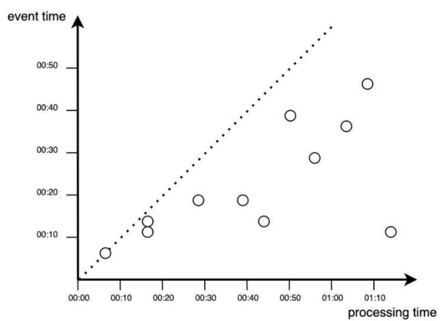

### Rodzaje uczenia maszynowego - podział klasyczny

1. Uczenie nadzoworane
    - klasyfikacja
    - regresja liniowa
2. Uczenie nienadzoworane
3. Uczenie przez wzmacnianie

### Uczenie maszynowe inaczej 

Podział ze względu na mozliwość trenowania przyrostowego przy uzyciu strumienia nadsyłanych danych:
1. **Uczenie wsadowe** - systemy wykorzystujące wszystkie zapisane dane. Zajmuje duzo czasu i zasobów. 
Często nazywane przetwarzaniem w trybie **off-line**. System taki jest wpierw uczony a następnie wdrazany do cyklu produkcyjnego
**i juz więcej nie jest trenowany!** . Wymiana modelu odbywa się po wytrenowaniu nowego modelu dla wszystkich danych - _proces ten łatwo zautomatyzować_.
2. **Uczenie przyrostowe** nazywane równiez procesem **on-line** model jest trenowany dla sekwencyjnie dodawanych (nowych) danych.
Co zrobić gdy napływające dane przestają być prawidłowe? (detekcja anomalii).

### Rzeczywisty proces generowania danych

Dane generowane są w postaci nieograniczonej - pojawiają się na skutek ciągłych działań systemów. 
W swoim telefonie wygenerowałeś dziś (a nawet na tych zajęciach !) wiele danych. 
Czy na następnych zajęciach lub tez jutro nie będziesz ich generował ? 
Przetwarzanie wsadowe dzieli dane na porcje o stałej długości czasu i uruchamia procesy przetwarzania w określonym przez uzytkownika
czasie. 

Na poprzednich zajęciach dowiedzieliśmy się czym jest pojedyncze zdarzenie. 
Zdefiniowaliśmy równiez ciągły strumień zdarzeń. 

Weźmy kilka takich zdarzeń i~uporządkujmy je w~kolejnych punktach czasu. 

Z wieloma systemami, które obsługują  strumienie danych miałeś już do czynienia. 
Są to np:
- hurtownie danych
- systemy monitorujące działania urządzeń (IoT)
- systemy transakcyjne
- systemy analityczne stron www
- reklamy on-line
- media społecznościowe
- systemy logowania 
- ....

> firma to organizacja, która generuje i odpowiada na ciągły strumień danych.

W przetwarzaniu wsadowym źródłem (ale i~wynikiem przetwarzania) danych jest **plik**. 
Jest on zapisywany raz i~można się do niego odwołać (może na nim działać) wiele procesów (zadań). 
Nazwa pliku to element identyfikujący zbiór rekordów. 

W~przypadku strumienia zdarzenie jest generowane tylko raz przez tzw. _producenta_ (zwanego też nadawcą lub dostawcą).
Powstałe zdarzenie przetwarzane może być przez wielu tzw. _konsumentów_ (odbiorców). 
Zdarzenia strumieniowe grupowane są w~tzw. **temat** (ang. **topic**). 

## Czas w analizie danych w czasie rzeczywistym

W przypadku przetwarzania wsadowego przetwarzamy dane historyczne i czas uruchomienia procesu przetwarzania nie ma nic wspólnego 
z czasem występowania analizowanych zdarzeń. 

Dla danych strumieniowych mamy dwie koncepcje czasu:
1. czas zdarzenie (event time) - czas w którym zdarzenie się wydarzyło.
2. czas przetwarzania (processing time) - czas w którym system przetwarza zdarzenie.

W przypadku idealnej sytuacji: 

W~rzeczywistości przetwarzanie danych zawsze odbywa się z pewnym opóźnieniem, co reprezentowane jest przez punkty pojawiające się poniżej funkcji dla sytuacji idealnej (poniżej diagonalnej).

W~aplikacjach przetwarzania strumieniowego istotne okazują się różnice miedzy czasem powstania zdarzenia i~jego procesowania. 
Do najczęstszych przyczyn opóźnienia wyszczególnia się przesyłanie danych przez sieć czy brak komunikacji między urządzeniem a~siecią. 
Prostym przykładem jest tu przejazd samochodem przez tunel i~śledzenie położenia przez aplikację GPS. 

Możesz oczywiście zliczać ilość takich pominiętych zdarzeń i~uruchomić alarm w~sytuacji gdy takich odrzutów będzie za dużo. 
Drugim (chyba częściej) wykorzystywanym sposobem jest zastosowanie korekty z~wykorzystaniem tzw. \it{watermarkingu}.

Proces przetwarzania zdarzeń w~czasie rzeczywistym można przedstawić w~postaci funkcji schodkowej, reprezentowanej na rysunku:

Jak można zauważyć nie wszystkie zdarzenia wnoszą wkład do analizy i~przetwarzania. 
Realizację procesu przetwarzania wraz z~uwzględnieniem dodatkowego czasu na pojawienie się zdarzeń (watermark) można przedstawić 
jako proces obejmujący wszystkie zdarzenia powyżej przerywanej linii. 
Dodatkowy czas pozwolił na przetworzenie dodatkowych zdarzeń, natomiast nadal mogą zdarzyć się punkty, które nie będą brane pod uwagę.

ng}
\centerline{\scriptsize Źródło: opracowanie własne}
\end{figure}

Przedstawione na wykresach sytuacje jawnie wskazują dlaczego pojęcie czasu jest istotnym czynnikiem i wymaga ścisłego określenia już na poziomie definiowania potrzeb biznesowych.
Przypisywanie znaczników czasu do danych (zdarzeń) to trudne zadanie. 

## okna czasowe 

**Okno rozłączne** (ang. _tumbling window_) czyli okno o stałej długości. 
Jego cechą charakterystyczną jest to, iż każde zdarzenie należy tylko do jednego okna. 

**Okno przesuwne** (ang. _sliding window_) obejmuje wszystkie zdarzenia następujące w określonej długości między sobą. 

**Okno skokowe** (ang. _hopping window_) tak jak okno rozłączne ma stałą długość, ale pozwala się w~nim na zachodzenie jednych okien na inne.
Stosowane zazwyczaj do wygładzenia danych.

